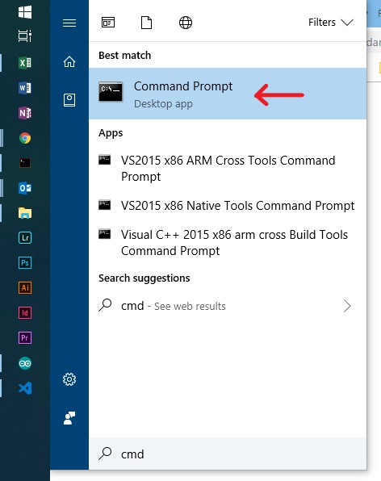

# How to use this program
1. Save the executable on your desktop
2. Open CMD by going to the Windows start men and typing cmd



3. In CMD, type: `cd Desktop` and press ENTER


4. Create a table with the people to check and save it as a CSV file **on your desktop**. The file shall have this format:

| First name    | Last name     | FIV no |
| ------------- |---------------| ------:|
| Mario         | Rossi         | 123456 |
| Pietro        | Bianchi       | 456789 |

5. In CMD, type `app-win.exe -f filename.csv -u username -p password`, where `filename.csv` is the name of the file containing the people to check and `username` and `password` are the credentials you use to log into the FIV portal


6. Press ENTER; after a few seconds the program will generate a file named **results.csv** on your desktop containing the results of the check, and it will open such file automatically in Excel

# Troubleshooting
## Missing input file
If you don't specify a valid file containing the names to check, the program will exit displaying the following error:
```
Error: missing source file; check the file path
```

check that you specified the correct file name

## Wrong username or password
If you input the wrong username or password, the program will exit displaying the following error:
```
Error: login failed; check your username and password
```

check that you specified the correct username and password

## Other errors
Send an email to francesco@batttaglini.net with a screenshot of the error displayed. Bear in mind he's in Australia, so you might have to wait a bit for a response.